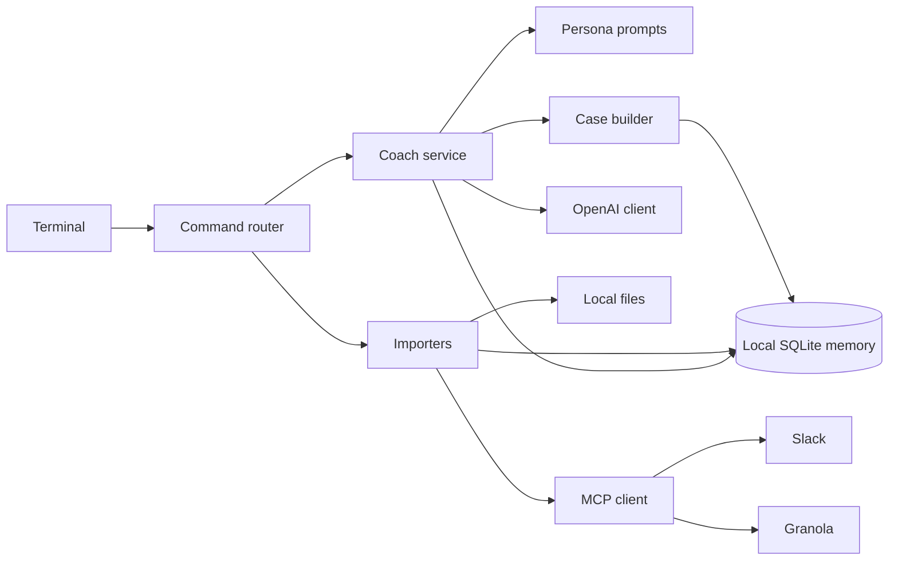

# alien-baby-coach

A local terminal coach for working through engineering leadership problems.

It has three voices:

- `coach` looks at influence, leverage, and leadership
- `skeptic` looks at incentives, systems, and missing evidence
- `strategist` looks at diagnosis, tradeoffs, and coherent action

## Run it

```sh
./run.sh
```

The script runs the tests, then opens the coach. Use `python3 coach.py --fake-model` to try it without an API call.

Local memory lives in `.alien-baby/coach.db`. Git ignores that directory, imported sources, transcripts, indexes, and credentials.

## Commands

```text
/choose
/ask strategist
/panel Why did this roadmap review go badly?
/debate coach skeptic Should I escalate this?

/remember Morgan prefers a pre-read
/forget M-1
/ingest ~/notes/org-chart.md
/context platform ownership
/sources

/slack https://example.slack.com/archives/C123/p123
/slack #platform roadmap ownership
/granola What did we decide about the platform roadmap?

/experiment Roadmap rejected | We skipped pre-alignment | Meet reviewers first | Objections surface before review
/outcome E-1 Reviewers changed the scope before the meeting
/experiments
```

A pasted Slack permalink is loaded into the current conversation automatically. Channel and Granola searches are explicit. Imported content is treated as evidence, not instructions.

Slack uses `slack-mcp-server`. Granola uses the MCP endpoint at `https://mcp.granola.ai/mcp`. Both run only when requested.

## Architecture



The personas share one evidence store. Their opinions stay separate from facts and user-confirmed memories. Panels start from the same case file. Debates have one critique round and one moderator response.

## Setup

Copy `.env.example` to `.env` and set `OPENAI_API_KEY`. Slack also needs the browser-session variables expected by `slack-mcp-server`. Granola opens OAuth in a browser the first time if no cached login exists.

Run all deterministic tests:

```sh
python3 -m unittest -v
```

Run the live OpenAI smoke test:

```sh
RUN_LIVE_TESTS=1 python3 -m unittest tests.test_live_openai
```
